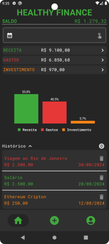

Don't speak Portuguese? <a href="./README.md">Clique here</a> to view this page in English.

<h1 align="center">
  
Healthy Finance

  
  
  
</h1>

## 💻 Introdução

Bem-vindo ao Healthy Finance! O aplicativo foi desenvolvido para ajudar você a ter controle sobre sua saúde financeira, rastreando suas receitas, despesas e investimentos com facilidade.

## ✨ Principais Funcionalidades

- **Gerenciamento de Conta do Usuário**: Crie uma conta e faça login com segurança para começar a gerenciar suas finanças.

- **Adicionar Transações**: Adicione transações facilmente em diferentes tipos: receita, despesa e investimento.

- **Opções de Filtro**: Filtre suas transações por mês e ano para obter uma visão clara do seu histórico financeiro.

- **Insights Visuais**: Veja gráficos informativos que mostram a porcentagem de seus gastos em diferentes categorias.

[▶️ Clique aqui](https://youtu.be/4eF63EPHd6Q) para assistir ao vídeo de demonstração completo no YouTube.

## 💿 Guia de Instalação

[Clique aqui](./installation-guide.md#guia-de-instalação-pt---br) para acessar o guia completo de como fazer a instalação e rodar o app.

## ✔️ Tecnologias

- `Android Studio`
- `Jetpack Compose`
- `Firebase`
- `MPAndroidChart`

## 🎯 Próximos Passos

Aprimorar o app utilizando Injeção de Dependências, Arquitetura MVVM.

## ✒️ Considerações Finais

No vídeo de demonstração o Calendário está sempre em Inglês porque o dispositivo está em Inglês, se o idioma do dispositivo estivesse em Português, o calendário estaria em Português. Por fim, como iniciante, estou extremamente satisfeito com o resultado e com a jornada que percorri para alcançá-lo.

## 📄 Licença

Esse projeto está sob a licença MIT. Veja o arquivo [LICENSE](./license) para mais detalhes.
