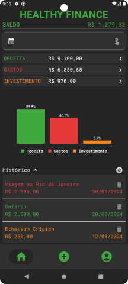

Não fala inglês? <a href="./README-pt.md">Clique aqui</a> para ver essa página em Português.

<h1 align="center">
  
Healthy Finance

  
  
  
</h1>

## 💻 Introduction

Welcome to Healthy Finance! The app is designed to help you take control of your financial health by tracking your income, expenses, and investments with ease.

## ✨ Key Features

- **User Account Management**: Create an account and log in securely to start managing your finances.

- **Add Transactions**: Easily add transactions of different types: income, expenses, and investments.

- **Filtering Options**: Filter your transactions by month and year to get a clear view of your financial history.

- **Visual Insights**: View insightful graphs that show the percentage of your spending across different categories

[▶️ Click here](https://youtu.be/4eF63EPHd6Q) to watch the full demonstratting video on YouTube.

## 💿 Installation Guide

[Click here](./installation-guide.md) to access a complete guide on how to install and run this app.

## ✔️ Technologies

- `Android Studio`
- `Jetpack Compose`
- `Firebase`
- `MPAndroidChart`

## 🎯 Next Steps

Enhance the app by implementing DI (Dependence Injection) and MVVM Architecture.

## ✒️ Final Considerations

In the demonstration video the Calendar is always in English because the device is in English, if the device's language was in Portuguese, the calendar would be in Portuguese. Finally, as a beginner, I am extremely pleased with the result and the journey I undertook to achieve it.

## 📄 Licença

This project is under the MIT license. See the [LICENSE](./license) file for more details.
